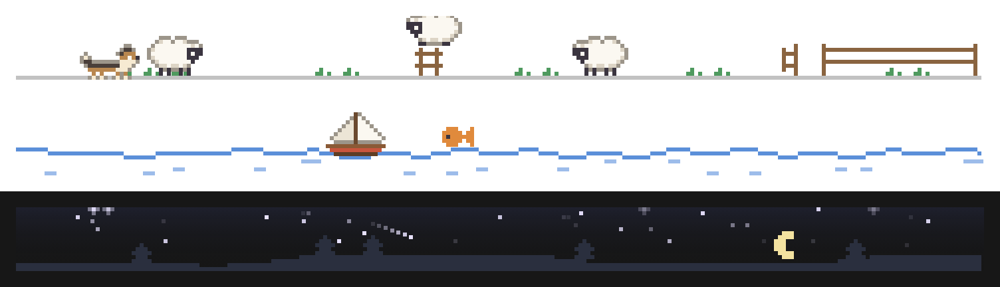
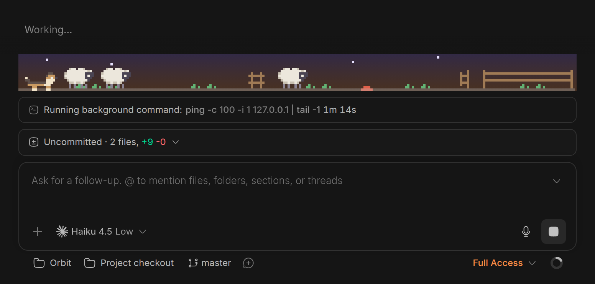
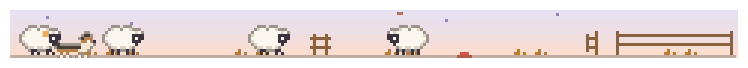
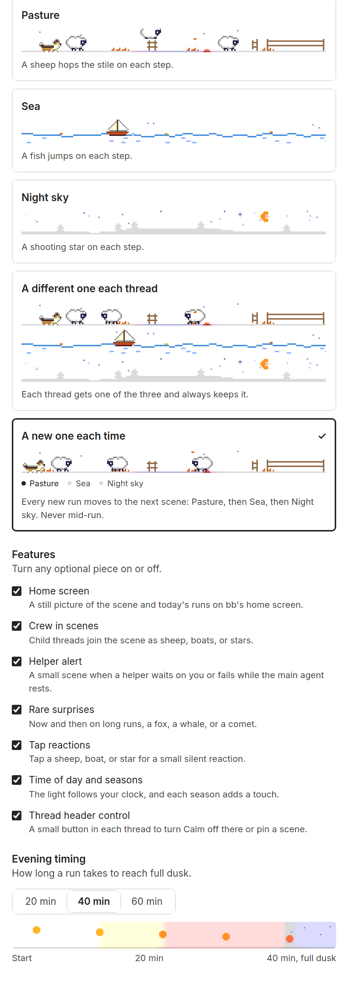

# Calm for bb

A spinner tells you an agent is busy, not whether it needs you, hit a limit,
or failed. This [bb](https://github.com/get-bb/bb) plugin puts a small
pixel-art scene above the prompt box that shows what the agent in the current
thread is doing, at a glance and without hurry.







*Demo threads written for the screenshots. bb 0.45.*

**Status: maintained.** Works on bb 0.45. Issues and pull requests are
welcome.

[Build checks](https://github.com/davideiffert/bb-plugin-calm/actions/workflows/check.yml) · [Changelog](CHANGELOG.md) · [MIT license](LICENSE)

## Try it

```sh
bb plugin install git:https://github.com/davideiffert/bb-plugin-calm@^1.0.0
```

Then open any thread and send a message. The scene eases in above the prompt
box while the agent works and closes the moment it finishes.

## What it shows

Every scene starts mid-action, because most runs are short.

| Moment | Pasture | Sea | Night sky |
| --- | --- | --- | --- |
| Working | Sheep amble across the meadow, a collie trots behind. | A sailboat drifts on moving water. | Stars twinkle over quiet hills. |
| A step happened | A sheep hops the stile. | A fish jumps. | A shooting star. |
| Long run | The light drifts toward evening. | The sun sets. | The moon climbs. |
| Waiting on you | Everything stops and the dog sits facing you. | The anchor drops and a lantern blinks. | The stars hold still and one glows. |
| Rate-limited | The flock is penned and the gate shuts. | Anchored. | Clouds roll in. |
| Error | A rain cloud until the next run. | A rain cloud. | A rain cloud. |
| Done | The strip closes right away. | Same. | Same. |
| Your crew | Each active child thread is a sheep with a colored ear tag. | A small boat in the fleet. | A bright star in its color. |
| A child finishes | It walks into the pen and fades. | It sails back to harbor. | It fades out. |
| Tap | A sheep says "♪ baa" and hops. | A boat rings a small bell. | A star twinkles. |
| Rare surprise | A fox trots along the fence. | A whale breaches. | A comet crosses. |

A step is one completed agent action: a command, a file read or change, a
tool call, a search. Step reactions happen at most once every couple of
seconds, so a burst stays calm. When rate-limited, a small "back at 3:40pm"
shows when the limit lifts, in your local time.

**The crew.** When the thread has delegated work to child threads, each one
joins the scene while the main agent works. A child that is waiting on you
shows an amber "!", one that failed wears a tiny rain cloud. Past four members
(six stars) the rest show as "+3". The full scene only ever means the main
agent is working. When it goes idle while helpers work on, Calm shows nothing
and leaves it to bb's own child thread bar. It speaks up only when a helper
needs you, with a half-height mini scene in the current scene's style. In the
Pasture, a sheep waits at a closed gate under a small amber "!" with the dog
sitting beside it, facing you. At sea, a small boat bobs with its lantern
blinking amber. In the night sky, a star pulses amber. A helper that failed
sits under its own little rain cloud (a star hides behind a cloud). Up to
three helpers show, then "+2". Beside it, small and quiet, the words: "1
helper is waiting on you", "1 helper failed", or both combined. Tap a figure
to open that helper's thread, or the words to open the first one waiting on
you. A failed helper drops off once you have opened it. A thread with no children looks exactly as before.

**Time and seasons.** The light follows your local clock: clear by day, dusky
in the evening, night after nine, easing back by eight in the morning. A long
run deepens it from there. The date adds one quiet touch per season: snow in
winter, flowers and petals in spring, a butterfly, a gull, or fireflies in
summer, golden grass, floating leaves, and a harvest moon in autumn.

**Details on hover.** Hover the dog, the boat, the moon, or a crew member, or
tap it on a touch screen, for the working time, step count, and children, or
the reset time when rate-limited. Taps are silent and never take focus from
the prompt box.

**Rare surprises** come about once in a long session of work, never while
waiting on you or after an error.

The strip shows only on the thread you're viewing. Opening and closing take a
quick 180ms height ease, so the prompt box glides instead of jumping. It
follows bb's light and dark mode and your system's reduced-motion setting,
where the strip opens and closes without easing and each moment becomes a
still picture that still shows the state (no surprises, no hops). It runs at
up to 30 frames a second and pauses while the tab or the strip is out of
sight.

**On the home screen.** A wide, still picture of the current scene, in
today's season and the real time of day, with one quiet line: "Today: 4 runs ·
23 hops · longest run 12 min" (jumps at sea, shooting stars at night). It
moves for a few seconds when the page opens, then holds still. "Today" is the
local day on the computer running bb. Runs count every thread on your bb.
Hops count the steps Calm counted for threads whose strip was open in the
last few minutes, since it reads a thread's history only while someone
watches it.

**In each thread's header.** A small scene icon opens a panel to turn Calm off
for just that thread or pin one scene to it. Each thread remembers its
choice.

## Settings

Open **Plugins → Installed plugins → Calm**.



- **Scene:** click a tile. Each one is a small live preview drawn by the real
  scene code. "A different one each thread" picks a scene from the thread's
  id, so a thread always keeps its scene. "A new one each time" moves to the
  next scene, in order, every time a thread starts a new run, never mid-run
  or while the strip closes, and remembers each thread's place across
  restarts. A pause of a few seconds between steps counts as the same run.
  "A new one each time" is the default.
- **Features:** switch off any optional piece: the home screen section, the
  crew in scenes, the helper alert, rare surprises, tap reactions, time of day
  and seasons, and the thread header control. All are on by default.
- **Evening timing:** 20, 40 (default), or 60 minutes to full dusk on a long
  run.

Changes apply to open threads right away. The previews pause when the page
isn't visible and hold still with reduced motion.

## How it decides

The plugin uses bb's public plugin events and SDK only:

- `thread.active`, `thread.idle`, and `thread.failed` for working, finished,
  and error.
- `interaction.pending`, plus a check of the thread's open interactions, for
  waiting on you.
- `turn.failed` with a `rate-limit` category for rate limits, taking the reset
  time from the provider's rate-limit windows.
- bb's once-a-second "new thread events" notice, then the thread's completed
  items, to count steps.
- Each thread record's `parentThreadId`, plus `threads.list({ parentThreadId })`
  once per strip, for the crew.

It keeps each thread's state in memory and sends changes to the open strip
over bb's realtime channel. In the plugin's own storage on your bb it keeps
your settings, today's counts for the home screen, the choice of any thread
you set from its header, and, for "a new one each time", a run count for each
thread (up to the 2,000 most recent threads; a thread's entries are removed
when it is archived or deleted). Nothing leaves your bb: no network calls, no telemetry.

**Performance:** about 4% of one CPU core while the strip animates, around 1.5%
while it waits or rains, and 0 when hidden (measured in Chrome on a 4-core
server). It draws at one canvas pixel per CSS pixel and lets the browser scale
up, redraws static layers only when the time of day, season, size, or theme
changes, slows to 15 frames a second for gentle changes and stops when nothing
moves, and drives every visible strip from one shared clock. On the server it
reacts to bb's events only, never polls, and counts steps incrementally for
threads with a strip open.

## Limits

- After a plugin reload or a bb restart, a running thread's evening clock
  starts over, because the turn's start time isn't stored.
- Rate-limit reset times appear only when the provider reports them.
  Otherwise the sign says "resting."
- Seasons follow northern-hemisphere months.
- Theme plugins that fold the cards above the prompt box into pills on phones
  (Liquid Glass does this by default) show Calm as a pill that opens the
  strip. Set that theme to show cards to see it all the time.

## Credit

Inspired by the calm mode in Kun Chen's
[firstmate](https://github.com/kunchenguid/firstmate). The Sea scene is the
closest to it. All the art and code here are new.

## License

[MIT](LICENSE)
