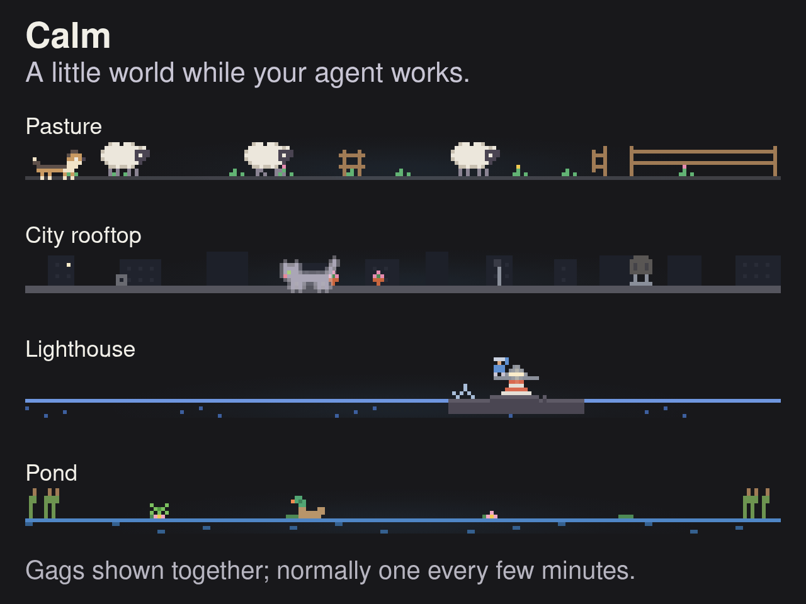
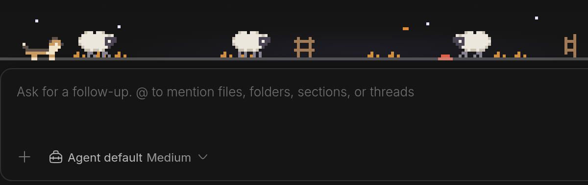
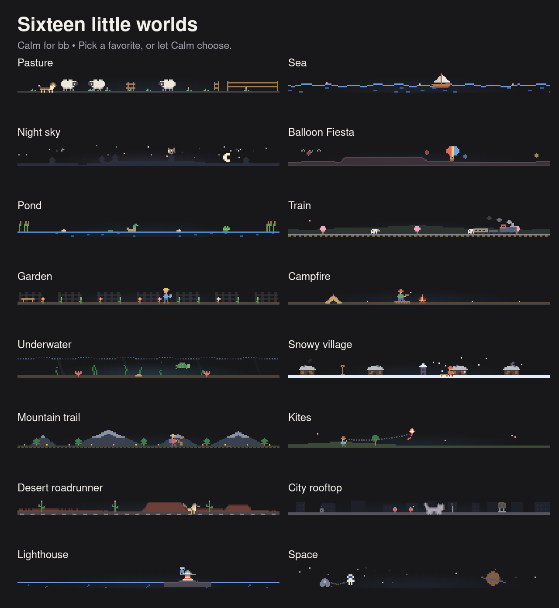
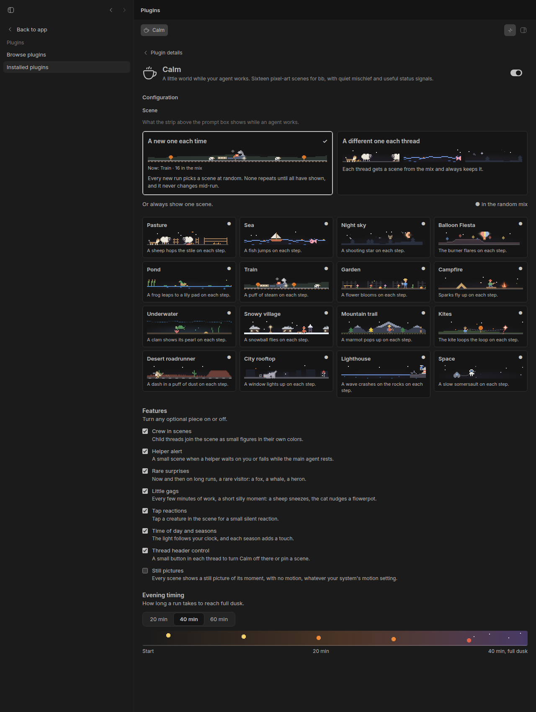

# Calm for bb

A little world while your agent works.

Sheep hop fences. A cat knocks a flowerpot off a rooftop. A lighthouse keeper loses his sandwich to a gull. Calm adds sixteen pixel-art scenes above [bb](https://getbb.app)'s prompt box, with small reactions as your agent works and occasional mischief along the way.



*Four scenes, with gags shown back-to-back. In real use, one appears every few minutes, with long stretches of calm between.*

[Watch the 17-second film](assets/launch/hero.mp4).

It has a job, too. An amber light means your agent needs you. A little rain cloud means something went wrong. When the work ends, the scene disappears.

## Try it

Requires bb 0.45 or later. Runs inside your bb, with no external service or account.

```sh
bb plugin install git:https://github.com/davideiffert/bb-plugin-calm@^1.1.0
```

Open a thread and send a message. Calm appears above the prompt box while the agent works.



*A demo run in bb 0.45. The scene sits above the prompt box until the agent finishes.*

[See the full app view](assets/launch/working.png).

## A new little world

By default, each run gets a new scene, with no repeats until the mix has gone through them all. Pick a favorite, give each thread its own scene, or leave any scene out of the mix.



Pasture, Sea, Night sky, Balloon Fiesta, Pond, Train, Garden, Campfire, Underwater, Snowy village, Mountain trail, Kites, Desert roadrunner, City rooftop, Lighthouse, and Space.

Each has three little gags, forty-eight in all. A frog misses its lily pad. A raccoon makes off with the marshmallows. An astronaut chases a wrench in slow motion. They appear about once every 3 to 5 minutes of work, only while the main agent is working. Switch them off whenever you like.

Tap a creature for a silent reaction. The light follows your local clock, long runs deepen toward dusk, and seasons add a small touch. Rare visitors drop by, too.

## Know when it needs you

| What happens | What you see |
| --- | --- |
| Your agent works | The scene plays. |
| It finishes an action | A sheep hops, a frog leaps, or another small reaction. |
| It needs your answer | The scene holds and an amber light glows. |
| It hits a rate limit | The scene rests and shows the return time, if bb reports it. |
| Something fails | A little rain cloud appears. |
| The run finishes | The scene closes. |

When your agent hands work to child threads, they join the scene as helpers: sheep, boats, bees, or other small figures. The settings call this **Crew in scenes**. Tap one for details and a silent reaction. When the main agent rests, a small alert appears only for helpers that need you or have failed. Tap a helper in that alert to open its thread.

## Make it yours

Open **Plugins → Installed plugins → Calm**.



Choose the scenes in your mix with the dots on their tiles. Turn off gags, surprises, tap reactions, helpers, or the time-of-day effects. **Still pictures** keeps the art still while continuing to show your agent's state. Calm also follows your system's reduced-motion setting and bb's light or dark mode.

Use the scene icon in a thread's header to pin a scene or turn Calm off for that thread. Disable the plugin in Installed plugins to turn it off everywhere.

## Local to your bb

Calm reads bb's thread activity and stores your preferences and scene choices in your bb. It sends nothing to an outside service and adds no telemetry. Animation pauses while the scene is out of sight.

Tested on bb 0.45. A few bb APIs are experimental and have fallbacks. Rate-limit return times depend on the provider. Seasons follow northern-hemisphere months. Some phone themes fold the scene into a card you tap to open.

[Scene reference](docs/scene-reference.md) · [How it works](docs/how-it-works.md) · [Changelog](CHANGELOG.md) · [Build checks](https://github.com/davideiffert/bb-plugin-calm/actions/workflows/check.yml)

## Add a scene

Start with [How to add a scene](docs/adding-a-scene.md) and the [scene style guide](docs/scene-style.md). Issues and pull requests are welcome.

Inspired by the calm mode in Kun Chen's [firstmate](https://github.com/kunchenguid/firstmate). All the art and code here are new.

[MIT license](LICENSE).
